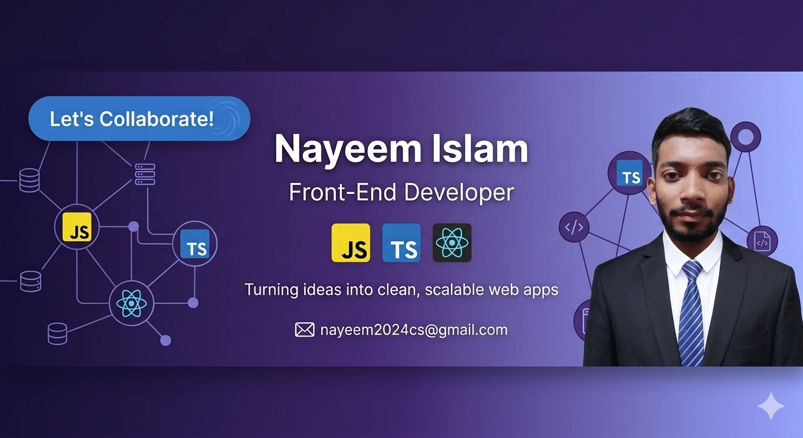

  

# Hi 👋, I'm Nayeem Islam 
### 🔭 I build things with JavaScript,TypeScript, and React

**I'm currently learning React**

## 🌐 Socials:
  

# 💻 Tech Stack:
### **Frontend**

### **Tools & Others**

# 📊 GitHub Stats:
 
 

### ✍️ Random Dev Quote

---

<!-- Proudly created with GPRM ( https://gprm.itsvg.in ) -->
